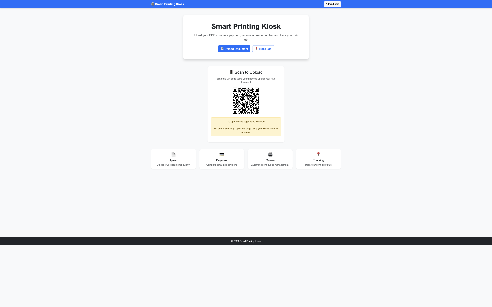
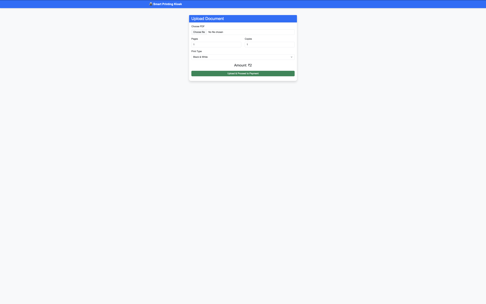
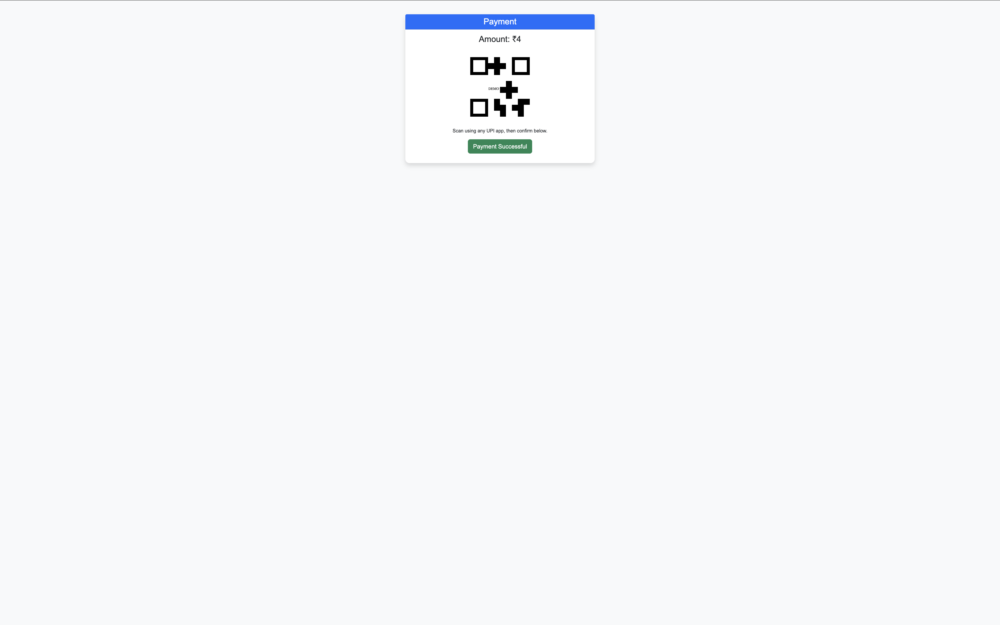
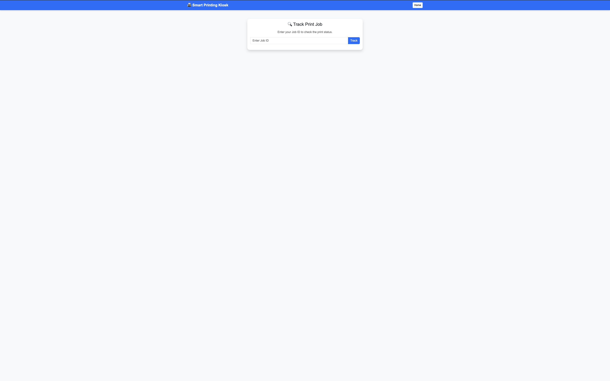
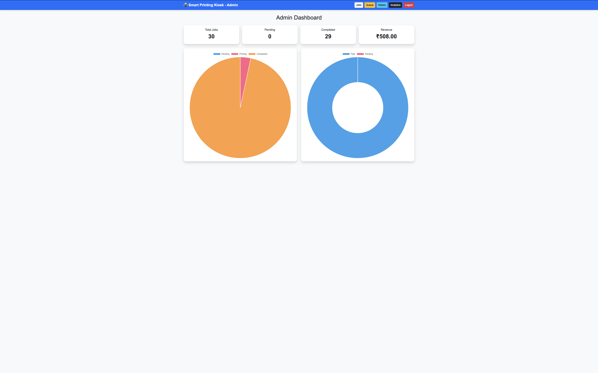
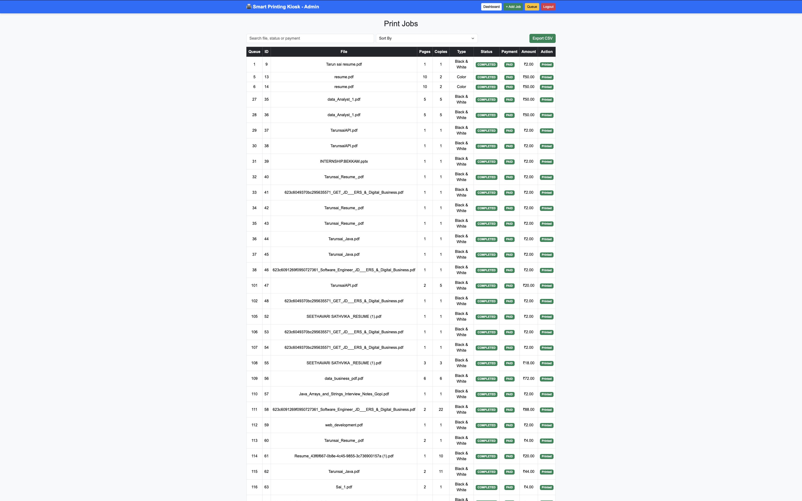
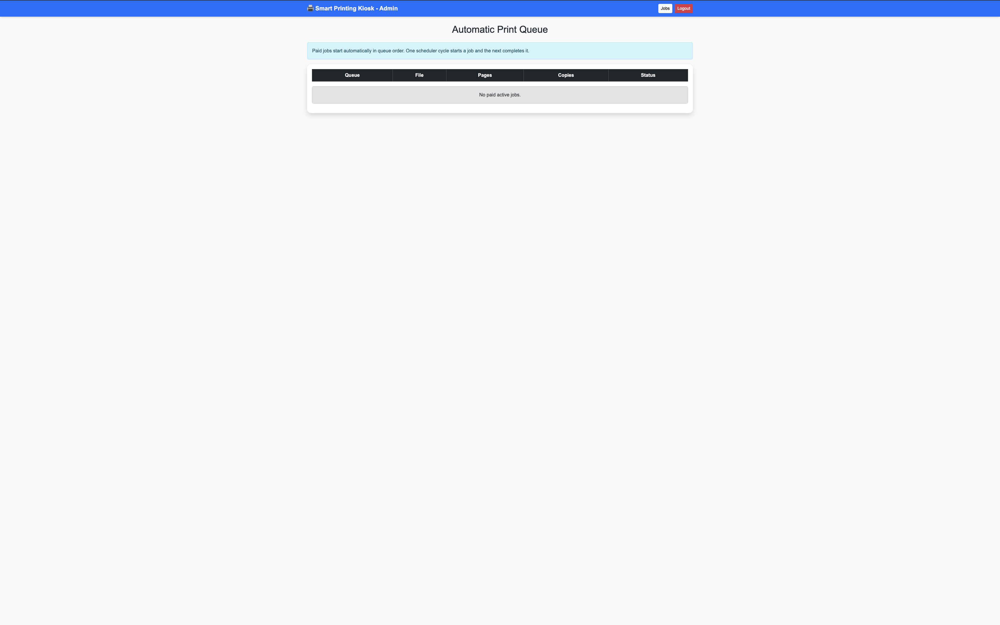
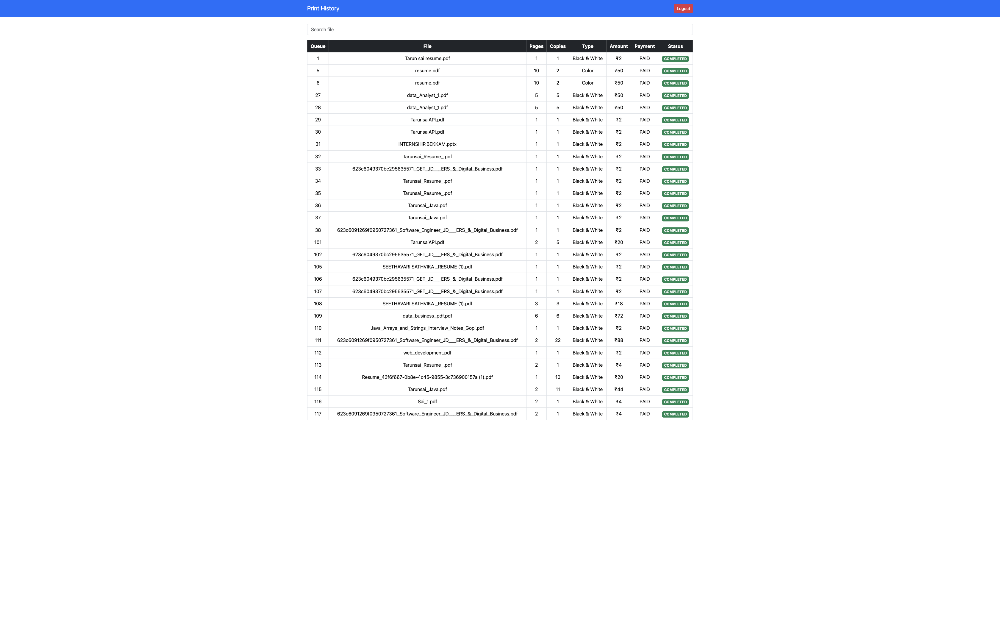
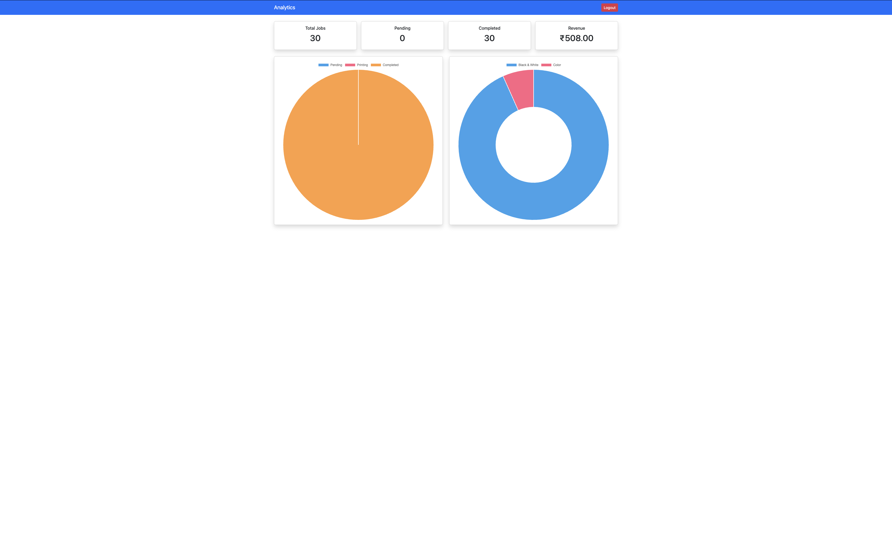

# 🖨️ Smart Printing Kiosk

A full-stack Java web application for managing document uploads, simulated payments, print queues, job tracking, and administrative print management.

---

## 📌 Project Overview

**Smart Printing Kiosk** is a full-stack application developed using **Java, Spring Boot, MySQL, HTML, CSS, Bootstrap, and JavaScript**.

The application allows customers to upload PDF documents, select printing options, complete a simulated payment, receive a queue number, and track the status of their print job.

Customers can also scan a **QR code** from the kiosk homepage to open the document upload page on their mobile device.

An administrator can securely log in to monitor print jobs, manage the printing queue, view completed jobs, and check basic printing analytics.

---

## 🚀 Features

### 👤 Customer Module

- 📄 Upload PDF documents
- 📑 Automatic PDF page counting
- 🖨️ Select Black & White or Color printing
- 🔢 Select number of copies
- 💰 Automatic print cost calculation
- 💳 Simulated payment
- 🔢 Automatic queue number generation
- 📍 Track print job using Job ID
- 🔄 Automatic status refresh
- 📱 QR code based mobile upload access

### 👨‍💼 Admin Module

- 🔐 Secure admin login
- 📊 Admin dashboard
- 📋 View print jobs
- 🖨️ Monitor print queue
- 📜 View print history
- 🔍 Search print jobs
- ↕️ Sort job information
- 📈 View printing analytics
- 📂 Preview uploaded PDF files
- 🚪 Secure logout

### ⚙️ Backend Features

- Spring Boot REST APIs
- Spring Security authentication
- BCrypt password encoding
- Spring Data JPA
- Hibernate ORM
- MySQL database integration
- PDF processing using Apache PDFBox
- Automatic queue processing using scheduler
- Global exception handling
- Application logging
- Swagger / OpenAPI documentation
- File cleanup after completion or cancellation

---

## 🔄 Application Workflow

```text
Customer
   │
   ▼
Open Kiosk / Scan QR
   │
   ▼
Upload PDF
   │
   ▼
Select Print Options
   │
   ▼
Calculate Amount
   │
   ▼
Simulated Payment
   │
   ▼
Queue Number Generated
   │
   ▼
Print Job Created
   │
   ▼
Track Job Status
   │
   ▼
PENDING
   │
   ▼
PRINTING
   │
   ▼
COMPLETED
```

---

## 🏗️ System Architecture

```text
                    CUSTOMER
                        │
                        ▼
               Web / QR Access
                        │
                        ▼
               HTML / CSS / JS
                        │
                        ▼
              Spring Boot Backend
                        │
          ┌─────────────┴─────────────┐
          │                           │
          ▼                           ▼
     MySQL Database              Upload Folder
          │
          ▼
     Queue Scheduler
          │
          ▼
      Print Status
          │
          ▼
     Admin Dashboard
```

---

# 📸 Project Screenshots

## 1. Customer Home Page

The customer homepage provides access to document upload, job tracking, and QR-based mobile upload.



---

## 2. Document Upload

Customers can upload PDF documents and select the required printing options.



---

## 3. Payment

The application calculates the printing amount and provides a simulated payment step.



---

## 4. Job Tracking

Customers can enter their Job ID and view the queue number and current print status.



---

## 5. Admin Login

The administration section is protected using Spring Security authentication.


---

## 6. Admin Dashboard

The dashboard provides an overview of print jobs and kiosk activity.



---

## 7. Print Jobs

Administrators can view and manage print job information.



---

## 8. Print Queue

The queue page displays jobs waiting for or currently undergoing processing.



---

## 9. Print History

Completed print jobs can be viewed from the history section.



---

## 10. Analytics

The analytics page provides a visual overview of printing activity.



---

# 🛠️ Tech Stack

### Backend

- Java 21
- Spring Boot 3.5.4
- Spring Security
- Spring Data JPA
- Hibernate

### Frontend

- HTML5
- CSS3
- Bootstrap 5
- JavaScript

### Database

- MySQL

### Libraries

- Apache PDFBox
- BCrypt Password Encoder
- Chart.js

### Development Tools

- Maven
- Git
- GitHub
- VS Code
- MySQL Workbench
- Swagger / OpenAPI

---

# 📂 Project Structure

```text
SmartPrintingKiosk/
│
├── database/
│   └── setup.sql
│
├── screenshots/
│   ├── 01-home.png
│   ├── 02-upload.png
│   ├── 03-payment.png
│   ├── 04-tracking.png
│   ├── 05-admin-login.png
│   ├── 06-dashboard.png
│   ├── 07-jobs.png
│   ├── 08-queue.png
│   ├── 09-history.png
│   └── 10-analytics.png
│
├── src/
│   └── main/
│       │
│       ├── java/
│       │   └── com/tarun/PrintJobsSpring/
│       │       ├── config/
│       │       ├── controller/
│       │       ├── dto/
│       │       ├── entity/
│       │       ├── exception/
│       │       ├── repository/
│       │       ├── scheduler/
│       │       ├── security/
│       │       └── service/
│       │
│       └── resources/
│           ├── application.properties
│           │
│           └── static/
│               ├── admin/
│               ├── customer/
│               ├── display/
│               ├── css/
│               ├── images/
│               └── js/
│
├── pom.xml
├── README.md
└── .gitignore
```

> Runtime folders such as `target/` and `uploads/` are excluded from Git using `.gitignore`.

---

# 📡 REST API Overview

The Spring Boot backend exposes REST endpoints for customer and administrative operations.

### Customer Operations

| Method | Endpoint | Description |
|---|---|---|
| POST | `/printjobs/upload` | Upload a PDF document |
| POST | `/printjobs` | Create a print job |
| GET | `/printjobs/track/{id}` | Track a print job |
| GET | `/printjobs/current` | View current queue information |

### Admin Operations

| Method | Endpoint | Description |
|---|---|---|
| GET | `/printjobs` | View print jobs |
| PUT | `/printjobs/{id}` | Update a print job |
| PUT | `/printjobs/status/{id}` | Update print status |
| DELETE | `/printjobs/{id}` | Delete a print job |

Additional endpoints are used by the dashboard, history, queue, and analytics pages.

---

# 🗄️ Database

The application uses a MySQL database named:

```text
print
```

The main table is:

```text
print_jobs
```

Important fields include:

```text
job_id
file_name
file_path
pages
copies
print_type
amount
status
payment_status
queue_number
created_at
updated_at
```

---

# 🔐 Security

The administration module uses **Spring Security**.

Security features include:

- Admin authentication
- BCrypt password encoding
- Protected admin routes
- Session-based authentication
- Login and logout handling
- Public customer pages
- Protected administrative APIs

---

# 🖨️ Queue Processing

Paid print jobs are processed automatically by the application scheduler.

```text
Upload
   │
   ▼
Payment
   │
   ▼
PENDING
   │
   ▼
Scheduler
   │
   ▼
PRINTING
   │
   ▼
COMPLETED
```

The scheduler periodically checks eligible print jobs and updates their status.

---

# 📱 QR Code Upload

The customer homepage generates a QR code dynamically.

The QR destination is created using:

```javascript
window.location.origin + "/customer/upload.html"
```

This means the application does **not hardcode a specific computer IP address**.

During local network testing, customers can scan the QR code while the phone and computer are connected to the same network.

After cloud deployment, the same QR generation logic can automatically use the deployed application URL.

---

# ⚙️ Installation & Setup

## Prerequisites

Install:

- Java 21
- Maven
- MySQL
- Git

---

## 1. Clone the Repository

```bash
git clone https://github.com/tarunsai4411/Smart-Printing-Kiosk.git
```

Move into the project:

```bash
cd Smart-Printing-Kiosk
```

---

## 2. Configure MySQL

Create the database if required:

```sql
CREATE DATABASE print;
```

The application can also be configured to create the database automatically through its JDBC configuration.

---

## 3. Configure Environment Variables

Set your MySQL credentials locally.

### macOS / Linux

```bash
export DB_USERNAME=root
export DB_PASSWORD='your_mysql_password'
```

Optional admin credentials:

```bash
export APP_ADMIN_USERNAME=admin
export APP_ADMIN_PASSWORD=admin123
```

> Do not commit real database passwords or other secrets to GitHub.

---

## 4. Run the Application

```bash
mvn clean spring-boot:run
```

Wait until Spring Boot reports that Tomcat has started successfully.

---

# 🌐 Local Application URLs

After starting the application:

### Customer

```text
http://localhost:8080/customer/index.html
```

### Upload

```text
http://localhost:8080/customer/upload.html
```

### Track Job

```text
http://localhost:8080/customer/track.html
```

### Admin Login

```text
http://localhost:8080/admin/admin-login.html
```

### Display

```text
http://localhost:8080/display/index.html
```

### Swagger

```text
http://localhost:8080/swagger-ui/index.html
```

---

# 📱 Mobile Testing

For QR-based mobile upload during local development:

1. Connect the computer and phone to the same Wi-Fi network.
2. Start the Spring Boot application.
3. Find the computer's local network IP.
4. Open the customer homepage using that local network address.
5. Scan the generated QR code with the phone.
6. Upload the PDF from the mobile device.

The local IP address is used only at runtime and is not hardcoded into the project.

---

# 🔮 Future Enhancements

Possible improvements include:

- Real payment gateway integration using Razorpay or Stripe
- Email notifications
- SMS notifications
- Cloud deployment
- Cloud file storage
- Multiple printer support
- User accounts and login
- Printer hardware integration
- Print job priority management
- Improved analytics
- Docker deployment

---

# 📖 Learning Outcomes

Through this project, I gained practical experience with:

- Building REST APIs using Spring Boot
- Connecting Java applications with MySQL
- Spring Data JPA and Hibernate
- Implementing Spring Security
- Handling PDF file uploads
- Processing PDF metadata
- Creating frontend pages using HTML, CSS and Bootstrap
- Connecting JavaScript with REST APIs
- Managing application state and print queues
- Implementing scheduled background processing
- Handling application exceptions
- Using Git and GitHub for version control
- Testing applications across devices on a local network

---

# 👨‍💻 Author

## M. Tarunsai

**B.Tech Graduate | Java Full Stack Developer**

GitHub: `tarunsai4411`

---

# ⭐ Project Purpose

This project was developed as a practical full-stack project to apply Java, Spring Boot, MySQL, REST API, frontend development, security, and queue-management concepts in a single application.

---

# 📜 License

This project is intended for educational and portfolio purposes.